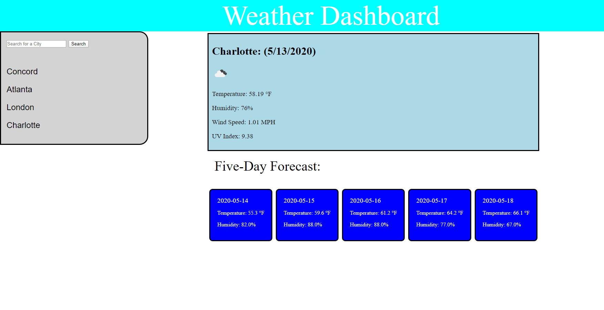

# 06 Weather Dashboard
****
# About
****
This is an application that displays the current weather of a given city as well as the five day forecase for that city. A user can enter in a city in the search bar, or simply click on the name of a city they have previously entered. This application is built with JavaScript, jQuery, CSS and HTML.
****
# Link to Deployed Application
****
https://graysondeese.github.io/WeatherDashboard/
****
# Screenshot
****
